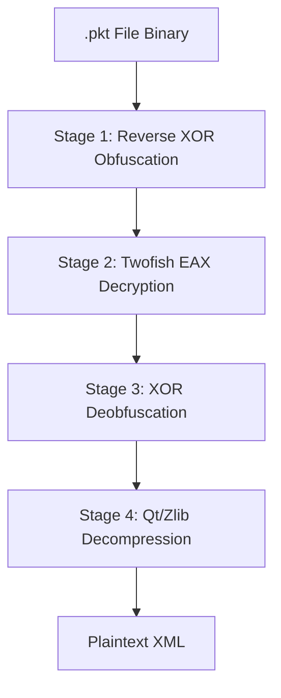

# PKT File Tool — Cisco Packet Tracer File Hacking

## What is this?

These scripts let you **decrypt**, **modify**, and **re-encrypt** Cisco Packet Tracer `.pkt` files
without ever touching the Packet Tracer GUI. You edit the raw XML inside the file instead.

## Files

```
pt/saves/
├── pkt_tool.py          # Decrypt/encrypt .pkt ↔ .xml
├── modify_pkt.py        # Apply the school network config to tema1
├── tema1_backup.pkt     # Original untouched backup
├── tema1.pkt            # Modified output (overwritten by modify_pkt.py)
└── README.md            # This file
```

## Requirements

```bash
pip install twofish
```

That's it. Everything else is Python 3 stdlib (`zlib`, `struct`, `xml.etree`).

---

## How the .pkt Decryption Works

Cisco Packet Tracer (`.pkt` or `.pka`) files use a multi-stage pipeline to secure the underlying XML data. Decryption reverses this process in four main stages:

### Stage 1: Initial Deobfuscation (Reverse XOR)
The file starts as a binary blob where bytes are scrambled based on the file length.
- **Algorithm:** Each byte `b[i]` is calculated by taking the byte at index `length - i - 1` and XORing it with `(length - i * length) & 0xFF`.
- **Purpose:** Restores the encrypted Twofish ciphertext.

### Stage 2: Twofish EAX Decryption
The core security layer uses the **Twofish** block cipher in **EAX mode**.
- **Key:** Fixed 16-byte key: `[137] * 16` (`0x89` hex).
- **IV:** Fixed 16-byte IV: `[16] * 16` (`0x10` hex).
- **Authentication:** Verifies the 16-byte CMAC tag at the end of the data to ensure integrity.

### Stage 3: Secondary Deobfuscation (XOR)
The underlying data is still obfuscated to hide the compression headers.
- **Algorithm:** `b[i] = a[i] ^ ((length - i) & 0xFF)`.
- **Purpose:** Reverses the obfuscation applied after compression.

### Stage 4: Qt/Zlib Decompression
The final step extracts the raw XML using the standard Qt `qCompress` format.
- **Header:** 4-byte big-endian integer for the uncompressed size.
- **Payload:** Standard **zlib** compressed data.

### Summary Flowchart



---

## Quick usage

### Decrypt a .pkt to XML

```bash
python3 pkt_tool.py -d tema1.pkt /tmp/tema1.xml
```

Now you have the full XML in `/tmp/tema1.xml`. Open it in any text editor.

### Encrypt XML back to .pkt

```bash
python3 pkt_tool.py -e /tmp/tema1.xml tema1_modified.pkt
```

### Run the full school network modification

```bash
python3 modify_pkt.py
```

This reads `tema1_backup.pkt`, applies all configs, writes `tema1.pkt`.

---

## XML structure cheat sheet

The decrypted XML has this rough structure:

```xml
<NETWORK>
  <DEVICES>
    <DEVICE>
      <ENGINE>
        <TYPE>PC</TYPE>           <!-- or Server, Switch, Router -->
        <NAME>PC0</NAME>
        <SAVE_REF_ID>12345</SAVE_REF_ID>

        <!-- Network ports -->
        <PORT>
          <TYPE>eCopperFastEthernet</TYPE>
          <IP>192.168.100.10</IP>
          <SUBNET>255.255.255.0</SUBNET>
          <HOST_IP>192.168.100.10</HOST_IP>
          <HOST_MASK>255.255.255.0</HOST_MASK>
          <HOST_GATEWAY>192.168.100.1</HOST_GATEWAY>
          <HOST_DNS>192.168.40.2</HOST_DNS>
          <PORT_GATEWAY>192.168.100.1</PORT_GATEWAY>
          <PORT_DNS>192.168.40.2</PORT_DNS>
          <PORT_DHCP_ENABLE>true</PORT_DHCP_ENABLE>
        </PORT>

        <!-- Switch/Router IOS config -->
        <RUNNINGCONFIG>
          <LINE>hostname Switch1</LINE>
          <LINE>interface FastEthernet0/1</LINE>
          <LINE> switchport mode trunk</LINE>
          ...
        </RUNNINGCONFIG>
        <STARTUPCONFIG>
          <!-- same format as RUNNINGCONFIG -->
        </STARTUPCONFIG>

        <!-- Server services -->
        <DNS_SERVER>
          <ENABLED>1</ENABLED>
          <NAMESERVER-DATABASE>
            <RESOURCE-RECORD>
              <TYPE>A-REC</TYPE>
              <NAME>www.scoala.ro</NAME>
              <TTL>86400</TTL>
              <IPADDRESS>192.168.40.2</IPADDRESS>
            </RESOURCE-RECORD>
          </NAMESERVER-DATABASE>
        </DNS_SERVER>

        <HTTP_SERVER>
          <ENABLED>1</ENABLED>
        </HTTP_SERVER>

        <!-- Server file system (for HTTP pages) -->
        <FILE_MANAGER>
          <FILE class="CDirectory">        <!-- root -->
            <FILES>
              <FILE class="CFileSystem">   <!-- http: -->
                <NAME>http:</NAME>
                <FILES>
                  <FILE class="CFile">
                    <NAME>index.html</NAME>
                    <FILE_CONTENT class="CHttpPage">
                      <TEXT>&lt;html&gt;...&lt;/html&gt;</TEXT>
                    </FILE_CONTENT>
                  </FILE>
                </FILES>
              </FILE>
            </FILES>
          </FILE>
        </FILE_MANAGER>

      </ENGINE>
    </DEVICE>
  </DEVICES>

  <LINKS>
    <LINK>
      <CABLE>
        <FROM>save-ref-id:12345</FROM>     <!-- matches SAVE_REF_ID -->
        <PORT>FastEthernet0</PORT>         <!-- port on FROM device -->
        <TO>save-ref-id:67890</TO>
        <PORT>FastEthernet0/2</PORT>       <!-- port on TO device -->
        <TYPE>eStraightThrough</TYPE>
      </CABLE>
    </LINK>
  </LINKS>
</NETWORK>
```

---

## Key gotchas

| Thing | Gotcha |
|-------|--------|
| **DHCP vs Static** | Set `PORT_DHCP_ENABLE` to `true` or `false`. When static, you MUST fill in `IP`, `SUBNET`, `HOST_IP`, `HOST_MASK`, `HOST_GATEWAY`, `HOST_DNS`, `PORT_GATEWAY`, `PORT_DNS`. |
| **DNS records** | Use `<RESOURCE-RECORD>` with `<TYPE>A-REC</TYPE>`, `<NAME>`, `<TTL>`, `<IPADDRESS>`. **NOT** `<ENTRY>` with `<DOMAIN_NAME>` — that's a different format PT ignores. |
| **HTTP pages** | The page content lives at `FILE_MANAGER → FILE(CDirectory) → FILES → FILE(CFileSystem, name=http:) → FILES → FILE(CFile, name=index.html) → FILE_CONTENT(CHttpPage) → TEXT`. **Not** in `HTML_TAB`. |
| **Switch/Router config** | IOS config is stored as `<LINE>` elements inside `<RUNNINGCONFIG>` and `<STARTUPCONFIG>`. Replace both. |
| **Saving in PT** | If you modify the `.pkt` on disk while PT has it open, **PT will NOT see changes**. You must re-open it with File→Open. And if you Ctrl+S in PT, it will **overwrite** your on-disk changes with its in-memory state. |
| **Interface up/down** | The IOS `no shutdown` must be in the config lines, AND the PORT element may need `ADMIN_DOWN=false` and `POWER=true`. |

---

## How to modify anything else

1. Decrypt to XML:
   ```bash
   python3 pkt_tool.py -d your_file.pkt /tmp/output.xml
   ```

2. Open `/tmp/output.xml` in a text editor, find what you want to change.
   - Search for device names, IP addresses, etc.
   - The structure follows the cheat sheet above.

3. Edit the XML.

4. Re-encrypt:
   ```bash
   python3 pkt_tool.py -e /tmp/output.xml your_file.pkt
   ```

5. Open in Packet Tracer (File → Open, don't save old one).

That's it. You now have full control over Packet Tracer files without the GUI.
